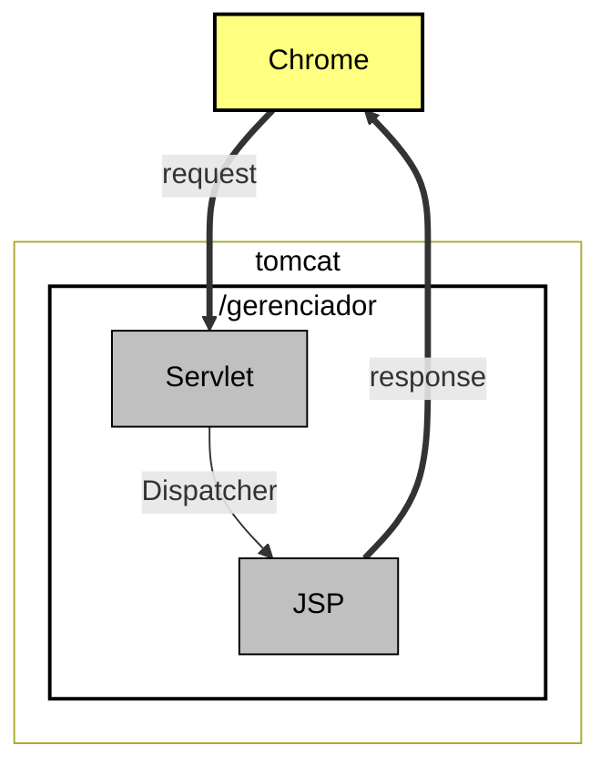

# Java WEB

## Servlets

### Adicionando o servidor
- Clicaremos no link disponível na área "Servers" e começaremos a realizar a configuração.
- Na nova janela de diálogo "Define a New Server".
- Clicaremos sobre "Apache > Tomcat v9.0 Server". 
	- Existem algumas opções editáveis, como "Server's host name", que manteremos com o modelo padrão. 
	- Em seguida, pressionaremos o botão "Next".

- Teremos a opção "Tomcat installation directory", na qual colocaremos o diretório em que o servidor foi salvo na máquina.

- Na opção "JRE", selecionaremos "jre-10.0.2" (às vezes o Eclipse já detecta que estamos utilizando o Java 10). 
	- Feito isso, pressionaremos o botão "Finish".

- Desse modo, na aba "Servers", será exibida a informação Tomcat v9.0 Server at localhost [Stopped, Republish]. 
- O Eclipse automaticamente criará um novo projeto para guardar as configurações do servidor, como podemos ver na área "Project Explorer", "Servers > Tomcat v9.0 Server at localhost-config". 
- Não podemos apagar ou fechar o projeto, pois, caso isso seja feito, o Eclipse não conseguirá mais acessar as configurações.

- Para iniciar o servidor, clicaremos sobre o ícone "Start the server" ou usaremos o atalho "Ctrl + Alt + R".
- Acesso ao Tomcat
```http://localhost:8080/```

### Criação de um projeto

- Para Cria o projeto vé em:
	- File > new > Dynamic Web Project
	- Em seguida preencha o **Project name** com o nome de *Gerenciador*.
	- Marque o checkbox: *Generate web.xml*
	- Finish
- Acesso a primeira página
- http://localhost:8080/gerenciador/bem-vindo.html

### Primeiro Servlet
- Acesso ao Servlet 
- http://localhost:8080/gerenciador/oi
- Define o caminho de acesso
```@WebServlet(urlPatterns="/oi")```
- Método ce acesso as respostas
```
@Override
	protected void service(HttpServletRequest req, HttpServletResponse resp) throws IOException {
			
	}
```
- Enviando parametros via queryParams
- http://localhost:8080/gerenciador/novaEmpresa?nome=Alura
- Acesso ao formulário
- http://localhost:8080/gerenciador/formNovaEmpresa.html
- Acesso a lista de empresas
- http://localhost:8080/gerenciador/listaEmpresas
#### Verbos
- GET foi pensado para acessar algum recurso.
- POST foi pensado para criar algum recurso.
- GET gera problemas quando precisamos enviar muitas informações.



#### Enviando dados para uma página JSP
- Página que será enviado os dados
- Settando a variável no **request**
- enviando o request e response
```
RequestDispatcher rd = request.getRequestDispatcher("/NovaEmpresaCriada.jsp");
request.setAttribute("nomeEmpresa", empresa.getNome());
rd.forward(request, response);
```
- **Importando lib na página JSP**
```
<%@ page import="java.util.List, br.com.caelum.gerenciador.servlet.Empresa"%>
```