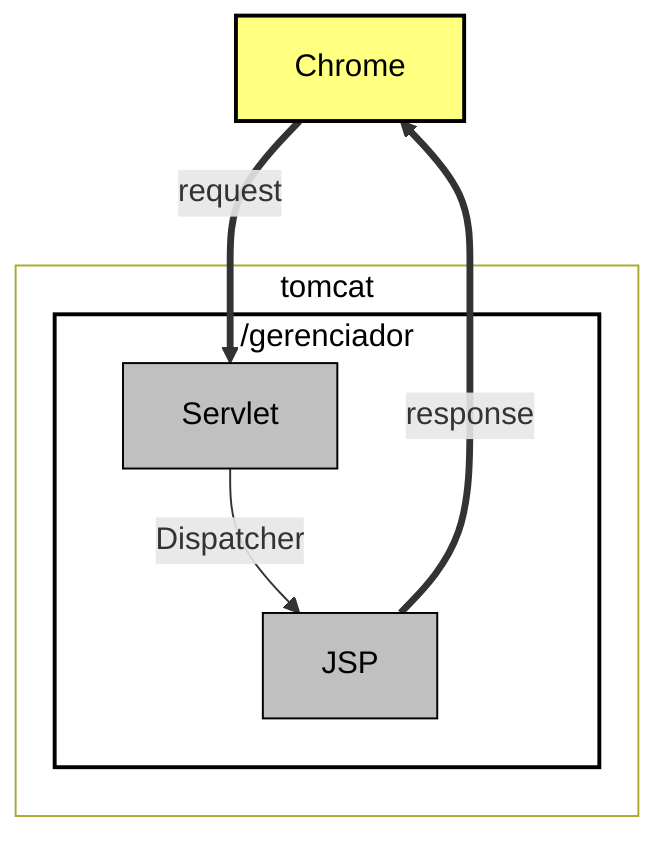
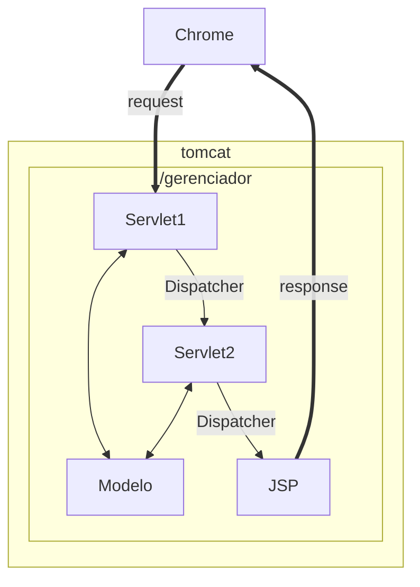
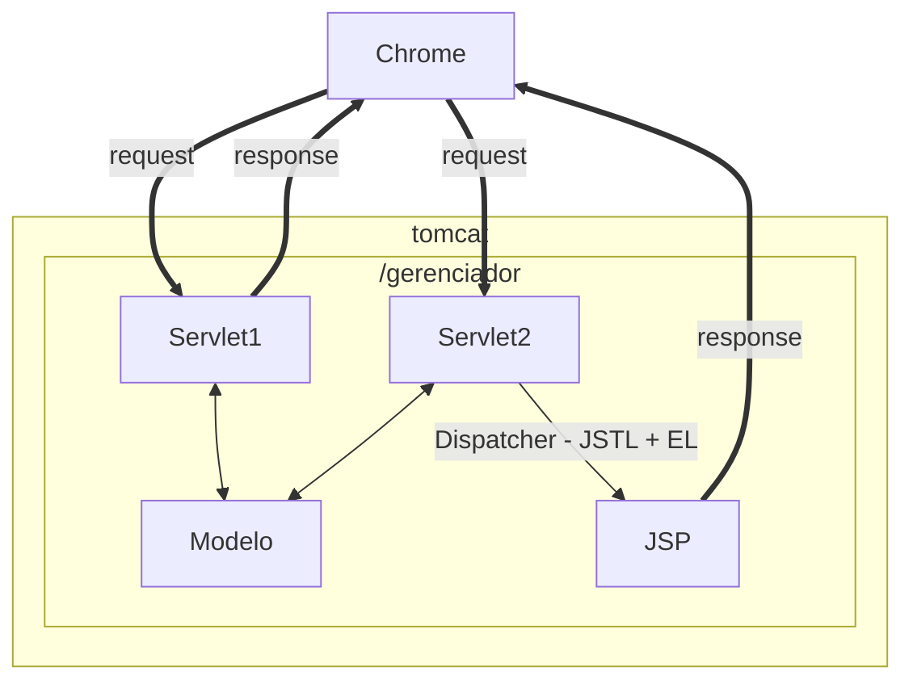

# Java WEB

## Servlets

### Adicionando o servidor
- Clicaremos no link disponível na área "Servers" e começaremos a realizar a configuração.
- Na nova janela de diálogo "Define a New Server".
- Clicaremos sobre "Apache > Tomcat v9.0 Server". 
	- Existem algumas opções editáveis, como "Server's host name", que manteremos com o modelo padrão. 
	- Em seguida, pressionaremos o botão "Next".

- Teremos a opção "Tomcat installation directory", na qual colocaremos o diretório em que o servidor foi salvo na máquina.

- Na opção "JRE", selecionaremos "jre-10.0.2" (às vezes o Eclipse já detecta que estamos utilizando o Java 10). 
	- Feito isso, pressionaremos o botão "Finish".

- Desse modo, na aba "Servers", será exibida a informação Tomcat v9.0 Server at localhost [Stopped, Republish]. 
- O Eclipse automaticamente criará um novo projeto para guardar as configurações do servidor, como podemos ver na área "Project Explorer", "Servers > Tomcat v9.0 Server at localhost-config". 
- Não podemos apagar ou fechar o projeto, pois, caso isso seja feito, o Eclipse não conseguirá mais acessar as configurações.

- Para iniciar o servidor, clicaremos sobre o ícone "Start the server" ou usaremos o atalho "Ctrl + Alt + R".
- Acesso ao Tomcat
```http://localhost:8080/```

### Criação de um projeto

- Para Cria o projeto vé em:
	- File > new > Dynamic Web Project
	- Em seguida preencha o **Project name** com o nome de *Gerenciador*.
	- Marque o checkbox: *Generate web.xml*
	- Finish
- Acesso a primeira página
- http://localhost:8080/gerenciador/bem-vindo.html

### Primeiro Servlet
- Acesso ao Servlet 
- http://localhost:8080/gerenciador/oi
- Define o caminho de acesso
```@WebServlet(urlPatterns="/oi")```
- Método ce acesso as respostas
```
@Override
	protected void service(HttpServletRequest req, HttpServletResponse resp) throws IOException {
			
	}
```
- Enviando parametros via queryParams
- http://localhost:8080/gerenciador/novaEmpresa?nome=Alura
- Acesso ao formulário
- http://localhost:8080/gerenciador/formNovaEmpresa.html
- http://localhost:8080/gerenciador/formNovaEmpresa.jsp
- Acesso a lista de empresas
- http://localhost:8080/gerenciador/listaEmpresas
#### Verbos
- GET foi pensado para acessar algum recurso.
- POST foi pensado para criar algum recurso.
- GET gera problemas quando precisamos enviar muitas informações.



#### Enviando dados para uma página JSP
- Página que será enviado os dados
- Settando a variável no **request**
- enviando o request e response
```
RequestDispatcher rd = request.getRequestDispatcher("/NovaEmpresaCriada.jsp");
request.setAttribute("nomeEmpresa", empresa.getNome());
rd.forward(request, response);
```
- **Importando lib na página JSP**
```
<%@ page import="java.util.List, br.com.caelum.gerenciador.servlet.Empresa"%>
```

#### JSTL
- **core**: controle de fluxo
- **fmt**: formatação / i18n (internacionalização)
- **sql**: executar SQL
- **xml**: gerar XML

#### Renomear contexto do projeto
- *Apenas fins didáticos*
    - Botão direito no projeto
        - Properties for ferenciador
        - Web Project Settings
        - Context root: nome_do_projeto_que_será_chamado_na_url

#### .jar JSTL
- [jar JSTL](https://caelum-online-public.s3.amazonaws.com/986-servlets-parte1/05/jstl-1.2.jar)

#### RequestDispatcher
- Delega o fluxo da requisição para qualquer recurso disponível.

#### Server side

#### Client side


### Mapeamento por XML no web.xml
```
<servlet>
    <servlet-name>NES</servlet-name>
    <servlet-class>br.com.alura.gerenciador.servlet.NovaEmpresaServlet</servlet-class>
</servlet>

<servlet-mapping>
    <servlet-name>NES</servlet-name>
    <url-pattern>/nova</url-pattern>
</servlet-mapping>
```

### Tomcat
- Inversão de controle significa que não é meu método main que instancia objetos, quem se preocupa com a criação das instâncias é o Tomcat.
- O Tomcat só irá instanciar as servlets de acordo com a necessidade! Além disso, ele instanciará apenas uma servlet de cada (singleton).
- responsáevl por fazer a inversão de controle
- Instância os servlet apenas quando são chamados
- WAR é o ZIP de projetos Java Web, que você roda de dentro de um servidor como o Tomcat.
- JAR é o ZIP para projetos comuns, que não são Web.
### Deploy da Aplicação
- Baixar tomcat
- Deploy do arquivo .**war**
- Botão direito no projeto > Export > WAR file
- depois do projeto gerado, ele deve ser colocado em:
    - pastado servidor apache > webapps
- Vamos executar o apache pela linha de comando
    - Entre no terminal na pasta onde esta o servidor apache
    - cd bin
    - startup.bat
    - *O tomcat desempacota o jar e já sobe uma instância*
- **Se acontece problema de versão, tipo: **(class file version 54.0)** *
    - Vê versão compilada no eclipse
        - Botão direito no projeto
            - properties
                - java compile
    - Voce tem 2 opções para corrigir isso:
        - Compilar novamente o projeto no eclipse
        - Muda a variável de ambiente, Linux ou Windowse rodar novamente

### muda URL da aplicação
- Na pasta do tomcat 
- vá em conf
- abra o arquivo server.xml
- Procure a porta 8080 e mude para 80

# Java Servlet: autenticação, autorização e o padrão MVC
- o que é servlet
    - Servlet é uma forma de atrelar uma requisição HTTP a um objeto Java!

```
select a.nome as Autor, l.titulo, l.preco from Livro_Autor la inner join Autor a on a.id = la.autores_id inner join Livro l on l.id = la.livro_id;
```

## Problemas com .jar
- [Resolução](https://cursos.alura.com.br/forum/topico-resolucao-para-excecao-caused-by-javax-persistence-persistenceexception-persistenceunit-livraria-unable-to-build-entitymanagerfactory-141576)