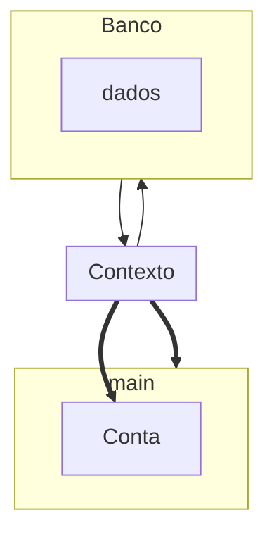

# Módulo 02

## Estado Managed
- Quando fazemos um find() no EntityManager, a JPA e o Hibernate buscarão no banco e criarão um objeto tipo Conta para ser devolvido, representando o registro buscado no database.
- Essa Conta devolvida ainda mantém uma referência, então a JPA ainda a conhece mesmo após a devolução. Sendo assim, costuma-se dizer que esta entidade Conta se encontra no estado Managed, ou seja, gerenciado pela JPA.

##### O que são transações?
- é um mecanismo para manter a consistência das alterações de estado no banco, visto que todas as operações precisam ser executadas com sucesso, para que a transação seja confirmada.

> Managed

- A característica do estado Managed é a sincronização automática.
- Nem toda conta com Id é necessariamente Managed

### Projeto
> curso_persistencia01

- [Continuação](./modulo03.md)
