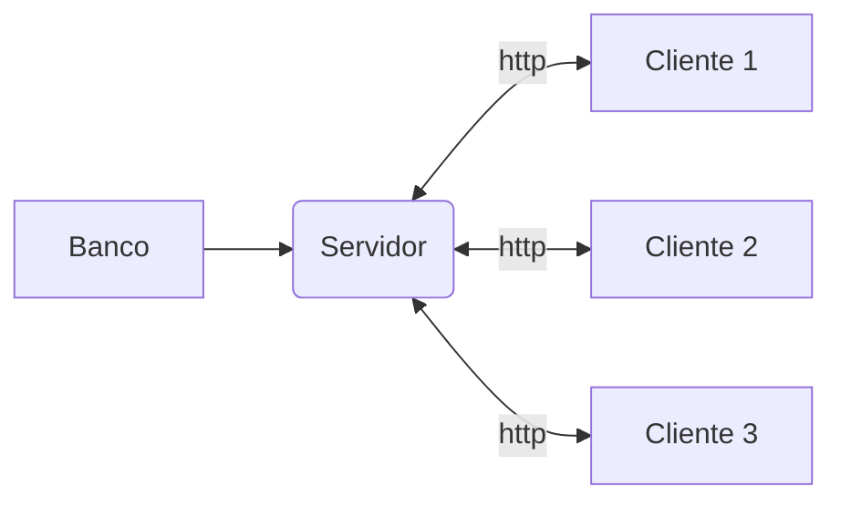
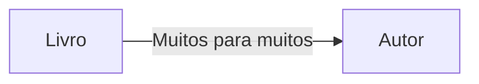
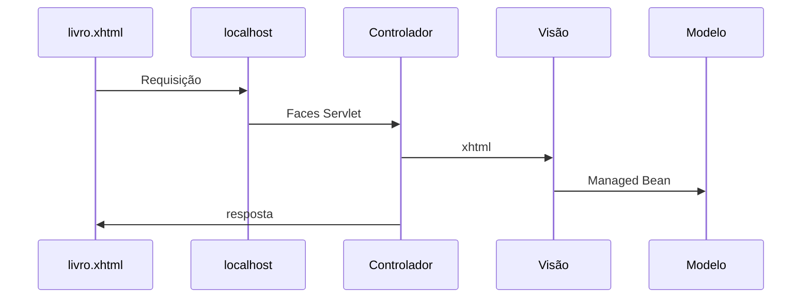
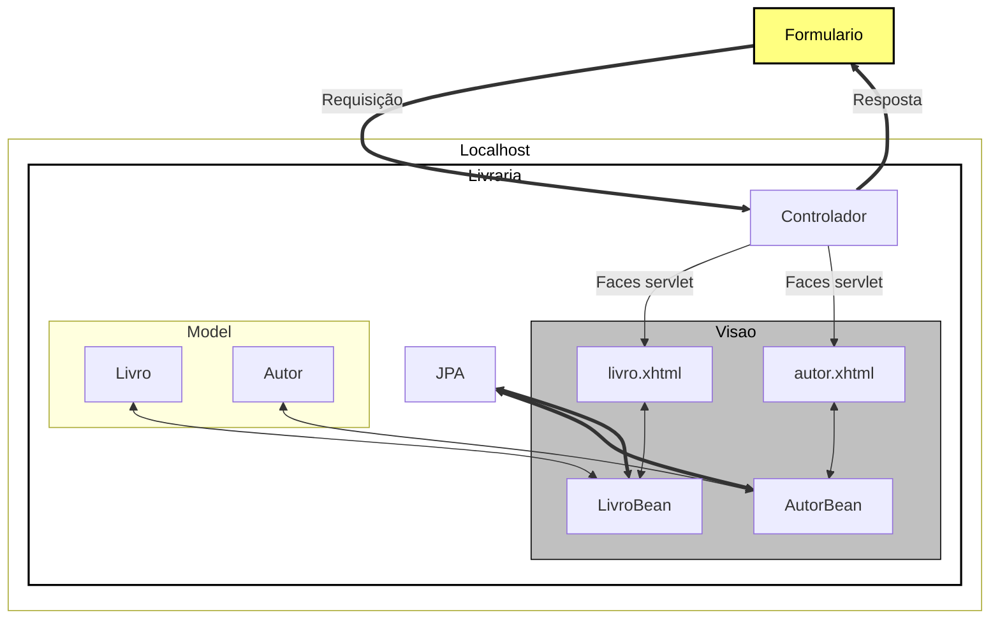
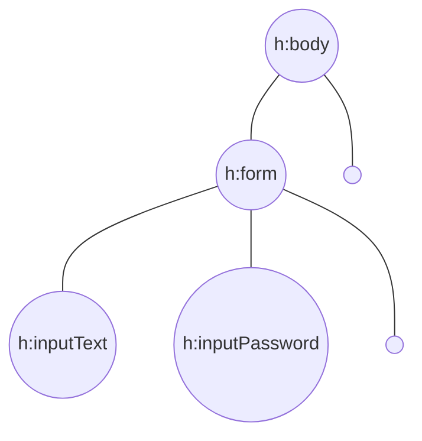

# Livraria

## Banco
- mysql-farmacia

### Docker
- Instalação e configuração do container do mysql

```
docker container run -e MYSQL_USER=andre -e MYSQL_PASSWORD=123456 -e MYSQL_DATABASE=farmacia -e MYSQL_ROOT_PASSWORD=123456 --name mysql-farmacia -p 3306:3306 mysql:5.7 --character-set-server=utf8mb4 --collation-server=utf8mb4_unicode_ci
```
- Entra no container
```
mysql -h localhost -u andre -p
```

## Aplicação


### Em aplicações Desktop
> Cliente Gordo

    - cada cliente tem uma cópia da aplicação
    - regra de negócio em cada cliente
    - atualização um a um
##
### Aplicação WEB
> Cliente magro

    - aplicação central
    - facilita a manuteção e gerenciabilidade



### Frameworks WEB
- JSF
- GWT
- APACHE WICKET
#### JSF
- é um padrão java EE para desenvolvimento web baseado em componentes mantido pelo JCP.
- Especificação JSF - JSR-245
- [JCP](https://jcp.org/en/jsr/detail?id=314)
- JSF é chamado um framework Web baseado em componentes.
- uso de componentes
- desenvolvimento orientado ao evento
- desenvolvimento stateful
- O servlet JSF tem o papel do controlador.
##### Implemantações dessa especificação
- Mojarra (Implementação referencial)
- Apache MyFaces
##### Extensões JSF
- [Prime Faces](https://www.primefaces.org/showcase/index.xhtml?jfwid=acf38)
- [RichFaces](http://showcase.richfaces.org/richfaces/component-sample.jsf?demo=select)
- [Ice Faces](http://icefaces-showcase.icesoft.org/showcase.jsf)

## Detalhes da contrução do projeto
- Pré-requisitos
    - Java SE 1.7
    - Eclipse Java EE
    - Apache Tomcat 7
- Projeto Livraria


##### Prepara tomcat
- Com o eclipse aberto
    - Digite ctrl + 3, digite server
    - clique em new server wizard
    - digite tomcat e escolha a versão 7
    - next e escolha onde salva
    - só finalizar
- Criar projeto
    - file 
    - new
    - Dynamic web project
    - coloque o nome do projeto
    - em *Target runtime* coloque Tomcat 7
    - em *Dynamic web module version* coloque 3.0
    - em *Configuration* coloque JavaServer Faces v2.0 project
    - next e na segunda marque pra gerar o web.xml
    - em *Type* coloque disable
    - em *URL Mapping pattenrs* coloque *.xhtml
- .JAR
    - todos os .jars devem fica em WEB-INF > lib

##### ATENÇÃO: Se você estiver usando MS-Windows, altere a propriedade encoding="ISO-8859-1" do cabeçalho do arquivo .xhtml para encoding="UTF-8"

##### Todo o mapeamento é feito pelo Faces Servlet
- Ao enviar a requisição é delegado o fluxo para a servlet
- O Servlet recebe a chamada e decide qual página ele vai chamar
- O controlador ler o xhtml e instância os componentes declarados
- No fim ele pega os componentes de apresentação e devolve para o navegador



### Classe Livro e LivroBean
- **Livro**: Responsabilidade de cadastrar um livro
    - atributos, getters e setters
- **LivroBean**: Responsabilidade de ser um livro
    - getter que busca o livro da classe Livro

### Model View Controller


### Ciclo de vida dos componentes JSF
- controlador instância os componentes declarados
- Árvore de componentes
    - criada apenas na primeira requisição
    - fica guardada na sessão http do usuário




- O modelo arquitetural o JSF se baseia é o MVC


### Anotações
- Indica que a classe será gerenciada pelo JSF
    - **@ManagedBean**
## Acesso aplicação
- http://localhost:8080/jsf-livraria/livro.xhtml
- http://localhost:8080/jsf-livraria/autor.xhtml