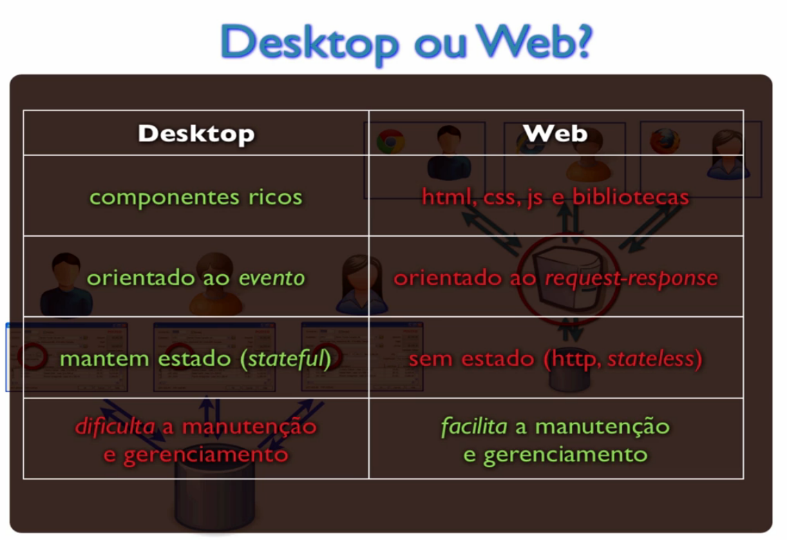
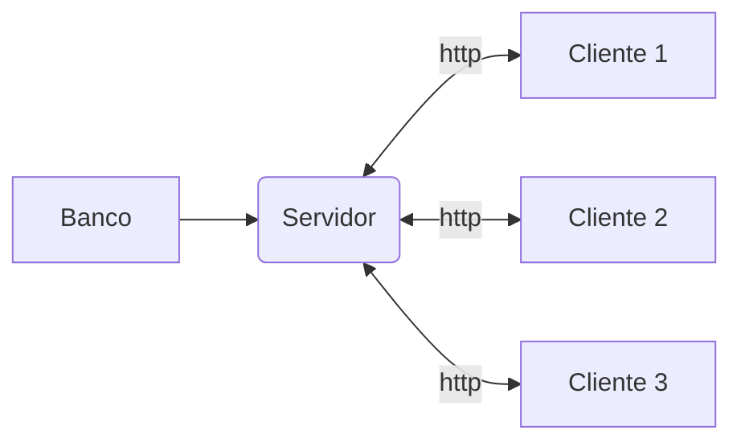
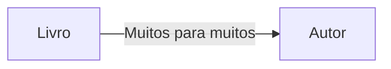
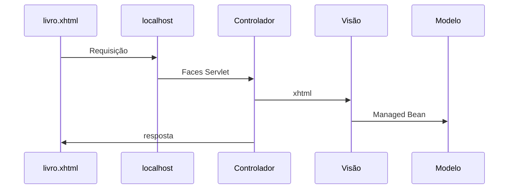
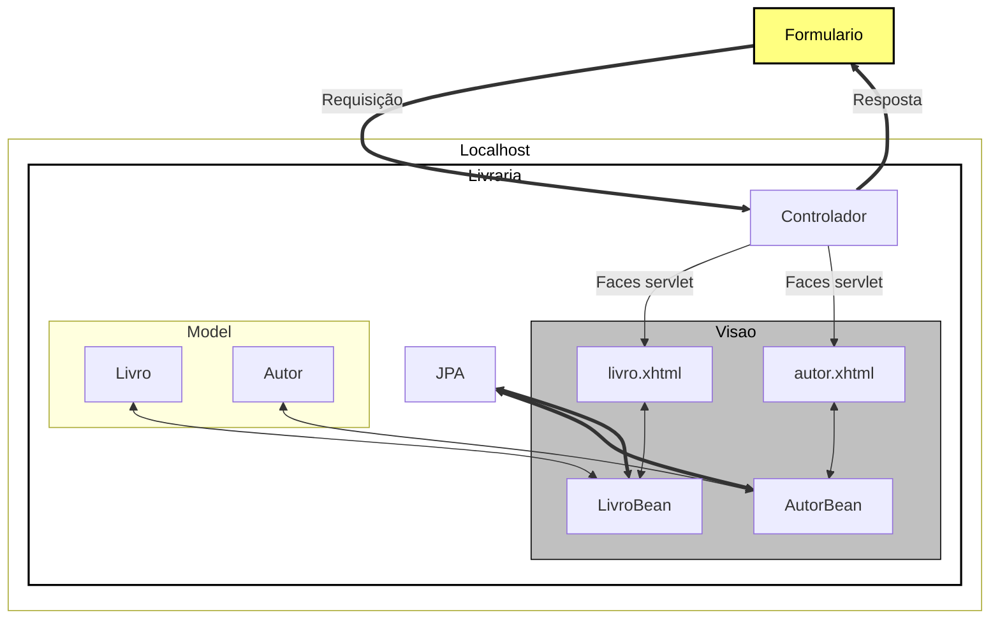
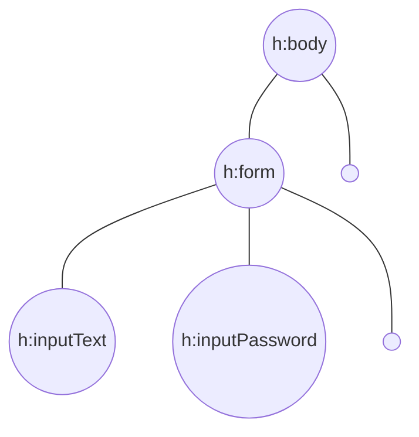
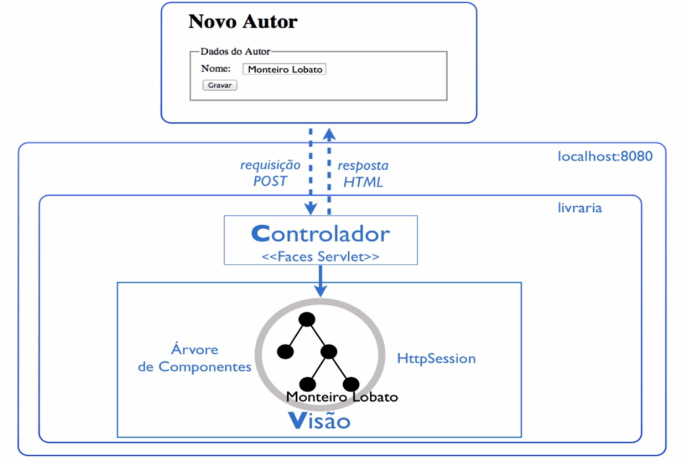
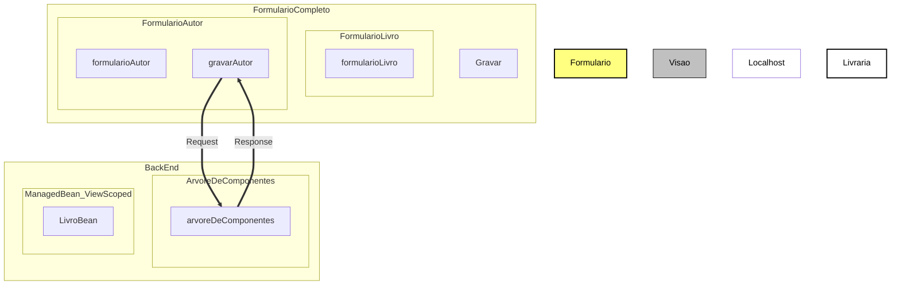

# Livraria

## Banco
- mysql-farmacia

### Docker
- Instalação e configuração do container do mysql

```
docker container run -e MYSQL_USER=andre -e MYSQL_PASSWORD=123456 -e MYSQL_DATABASE=farmacia -e MYSQL_ROOT_PASSWORD=123456 --name mysql-farmacia -p 3306:3306 mysql:5.7 --character-set-server=utf8mb4 --collation-server=utf8mb4_unicode_ci
```
- Entra no container
```
mysql -h localhost -u andre -p
```

## Aplicação


### Em aplicações Desktop
> Cliente Gordo

    - cada cliente tem uma cópia da aplicação
    - regra de negócio em cada cliente
    - atualização um a um
##
### Aplicação WEB
> Cliente magro

    - aplicação central
    - facilita a manuteção e gerenciabilidade



### Frameworks WEB
- JSF
- GWT
- APACHE WICKET
#### JSF
- é um padrão java EE para desenvolvimento web baseado em componentes mantido pelo JCP.
- Especificação JSF - JSR-245
- [JCP](https://jcp.org/en/jsr/detail?id=314)
- JSF é chamado um framework Web baseado em componentes.
- uso de componentes
- desenvolvimento orientado ao evento
- desenvolvimento stateful
- O servlet JSF tem o papel do controlador.
##### Implemantações dessa especificação
- Mojarra (Implementação referencial)
- Apache MyFaces
##### Extensões JSF
- [Prime Faces](https://www.primefaces.org/showcase/index.xhtml?jfwid=acf38)
- [RichFaces](http://showcase.richfaces.org/richfaces/component-sample.jsf?demo=select)
- [Ice Faces](http://icefaces-showcase.icesoft.org/showcase.jsf)

## Detalhes da contrução do projeto
- Pré-requisitos
    - Java SE 1.7
    - Eclipse Java EE
    - Apache Tomcat 7
- Projeto Livraria


##### Prepara tomcat
- Com o eclipse aberto
    - Digite ctrl + 3, digite server
    - clique em new server wizard
    - digite tomcat e escolha a versão 7
    - next e escolha onde salva
    - só finalizar
- Criar projeto
    - file 
    - new
    - Dynamic web project
    - coloque o nome do projeto
    - em *Target runtime* coloque Tomcat 7
    - em *Dynamic web module version* coloque 3.0
    - em *Configuration* coloque JavaServer Faces v2.0 project
    - next e na segunda marque pra gerar o web.xml
    - em *Type* coloque disable
    - em *URL Mapping pattenrs* coloque *.xhtml
- .JAR
    - todos os .jars devem fica em WEB-INF > lib

##### ATENÇÃO: Se você estiver usando MS-Windows, altere a propriedade encoding="ISO-8859-1" do cabeçalho do arquivo .xhtml para encoding="UTF-8"

##### Todo o mapeamento é feito pelo Faces Servlet
- Ao enviar a requisição é delegado o fluxo para a servlet
- O Servlet recebe a chamada e decide qual página ele vai chamar
- O controlador ler o xhtml e instância os componentes declarados
- No fim ele pega os componentes de apresentação e devolve para o navegador



### Classe Livro e LivroBean
- **Livro**: Responsabilidade de cadastrar um livro
    - atributos, getters e setters
- **LivroBean**: Responsabilidade de ser um livro
    - getter que busca o livro da classe Livro

### Model View Controller


### Ciclo de vida dos componentes JSF
- controlador instância os componentes declarados
- Árvore de componentes
    - criada apenas na primeira requisição
    - fica guardada na sessão http do usuário




- O modelo arquitetural o JSF se baseia é o MVC



### Lidando com escopos
- A vida do managedBean dura apenas um request
    - **@RequestScoped**
- Queremo que o livroBean exista emquanto a tela existir
    - **@ViewScoped**
    - Sobrevive por vários request
- O **h:selectOneMenu** é o componente próprio para a renderização de um combobox.
- Adicionamos o componente **f:selectItems** dentro do **h:selectOneMenu**, e usamos os atributos value, var, itemLabel e itemValue para respectivamente, recuperar os autores provindos do managed bean, nomear a variável que representará o autor, definir o texto que será mostrado nas opções e o valor das opções.
- Por padrão um ManagedBean adota o escopo da requisição **(@RequestScoped)**.
- Além dos escopos de requisição (@RequestScoped) e da tela (@ViewScoped) JSF também dá suporte ao escopo da sessão (@SessionScoped) e escopo da aplicação (@ApplicationScoped), tudo configurável pelas anotações.
- Utilizamos o componente h:dataTable referenciando a lista de dados pelo atributo value. Dentro do h:dataTable, utilizamos o h:column para definir as colunas que existirão na nossa tabela. No nosso exemplo, utilizamos também o h:outputText para renderizar os dados do autor dentro do h:column. Por exemplo:
```
<h:dataTable value="#{livroBean.autoresDoLivro}" var="autor">
    <h:column>
        <h:outputText value="#{autor.nome}"/>
    </h:column>
</h:dataTable>
```
### Conversão e validação de dados
- Para manipulação de datas
- Com essa anotação será gravado apenas a data
```
@Temporal(TemporalType.DATE)
private Calendar dataLancamento = Calendar.getInstance();
```
- Definindo o formato de conversão que o JSF deve utilizar
- Deve ser usado o componente f:convertDateTime para formatar a data, porém o conversor sabe lidar apenas com objetos do tipo java.util.Date. Por isso, devemos fazer um binding para #{livroBean.livro.dataLancamento.time}, onde time corresponde ao método getTime() da classe Calendar, que retorna um objeto do tipo java.util.Date.

- Devemos também definir um pattern. No nosso caso queremos dia/mês/ano então usaremos dd/MM/yyyy
```
<h:inputText id="dataLancamento"
    value="#{livroBean.livro.dataLancamento.time}">
    <f:convertDateTime pattern="dd/MM/yyyy"
        timeZone="America/Sao_Paulo" />
</h:inputText>
```
- Trabalhar com datas usando Calendar é muito mais fácil. É uma classe especializada para este dominio. Para criar uma instancia do tipo Calendar usaremos:
```
Calendar data = Calendar.getInstance()
```
Se quisermos ignorar o horário no banco de dados, podemos adicionar a anotação JPA **@Temporal**, passando como parâmetro a enum TemporalType.Date

#### Mensagens de validação
- A tag ```<h:messages />``` retorna todos os erros ocorridos na página
- Para que o erro seja exibido na mensagem, por exemplo temos que definir o campo como ```required="true"```.
- Se quisermos pesonalizar a mesagem, basta adicionar ```requiredMessage="Titulo obrigatório"``` com sua mensagem.
- Existem também os validadores como ```<f:validateLength maximum="40" />``` que define o tamanho máximo do campo, entre outros validadores.
#### **Validador personalizado**
- Valida se o valor informado começa com "1".
```
public void comecaComDigitoUm(FacesContext fc, UIComponent comp,  Object v) throws ValidatorException {
        String valor = v.toString();
        if(!valor.startsWith("1")){
            throw new ValidatorException(new FacesMessage("Deveria começar com um"));
        }
    }
```
- O atributo validator faz a associação do input com o método no **bean**
```
<h:inputText id="isbn" value="#{livroBean.livro.isbn}"
						validator="#{livroBean.comecaComDigitoUm}" />
```

### Validando preço
- O campo preço no cadastro de livros da página livro.xhtml aceita valor zerado e valores extremamente grandes. Utilize o validador f:validateDoubleRange para aceitar um valor mínimo de R$ 1,00 e máximo de R$ 1.000,00. Lembre-se que este validador possui dois atributos: minimum e maximum.

- O validador é aplicado para o componente h:inputText do preço:
```
<h:inputText id="preco" value="#{livroBean.livro.preco}" label="Preço">
  <f:validateDoubleRange minimum="1.0" maximum="1000.00"/>
</h:inputText>
```

### retornando um faces message no lugar de um throw
- Pegamos uma referência do contexto no momento da chamada
- Adicionamos uma mensagem através do addMessage, que recebe 2 parâmetros
    - client id,  ID definido no xhtml do componente
    - um objeto do tipo FacesMessage que recebe no construtor a messagem que sera mostrada.
```
FacesContext
    .getCurrentInstance()
    .addMessage("autor", new FacesMessage("Livro deve ter pelo menos um autor."));
```

### Páginas mais dinâmicas com AJAX
- Enviar apenas uma parte do formulário


- **execute** diz o ID de qual compoenete que queremos enviar na requisição
- **render** id dos componentes que queremos atualizar
- Necessário colocar o ```<h:head />``` no começo da página
```
<h:commandButton value="Gravar Autor"
    action="#{livroBean.gravarAutor}">
    <f:ajax execute="autor" render="tabelaAutores" />
</h:commandButton>
```
- o uso apropriado de requisições AJAX possibilita uma comunicação mais rápida com o servidor, dado que o mesmo só precisará responder com a parte da página que irá realmente mudar.
- Como o AJAX depende diretamente de JavaScript, é necessário que o JSF importe sua própria biblioteca JavaScript. Isso só será feito, caso o componente h:head esteja presente.


### Anotações
- Indica que a classe será gerenciada pelo JSF
    - **@ManagedBean**
## Acesso aplicação
- http://localhost:8080/jsf-livraria/livro.xhtml
- http://localhost:8080/jsf-livraria/autor.xhtml