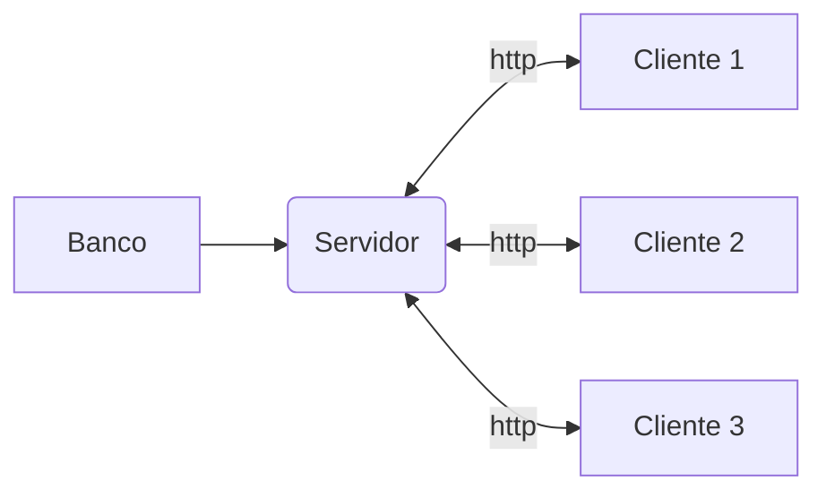
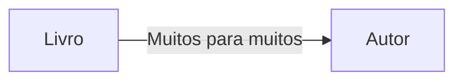
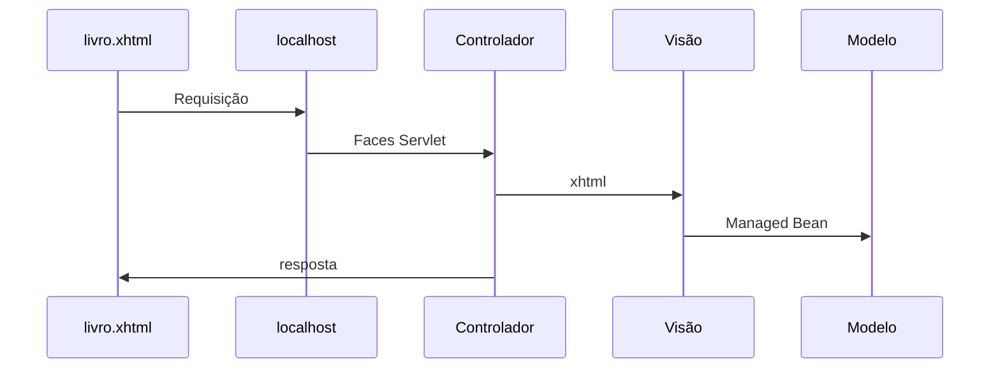
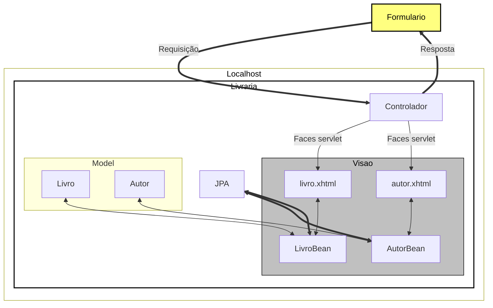
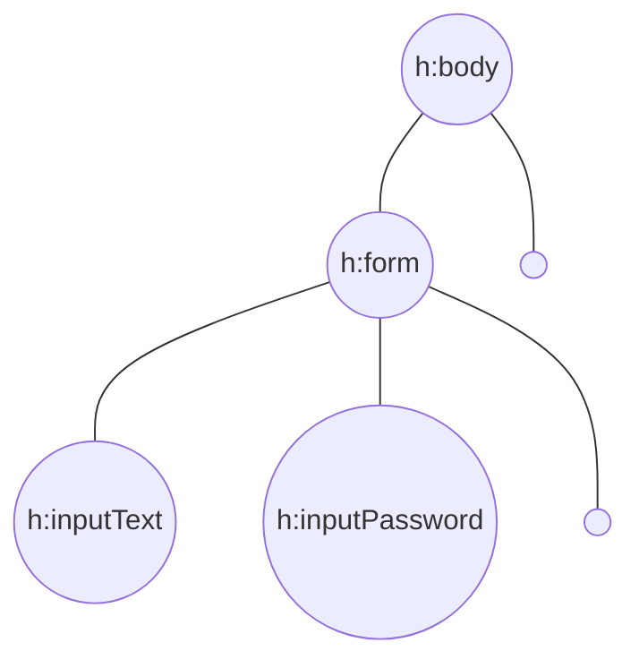
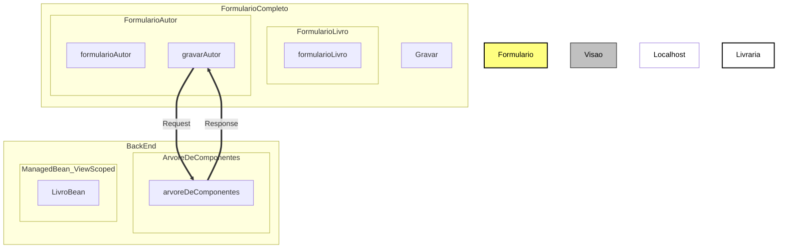
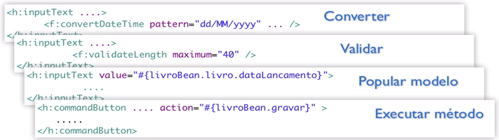
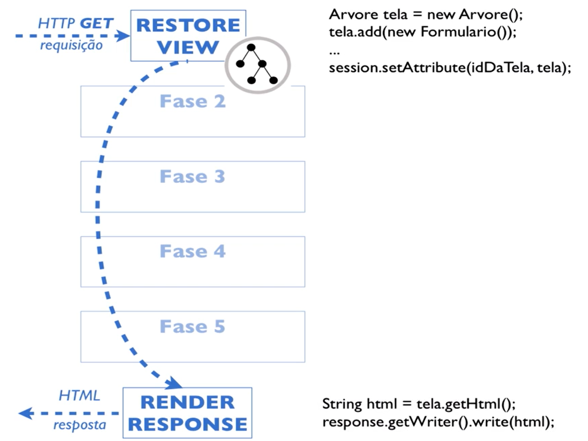
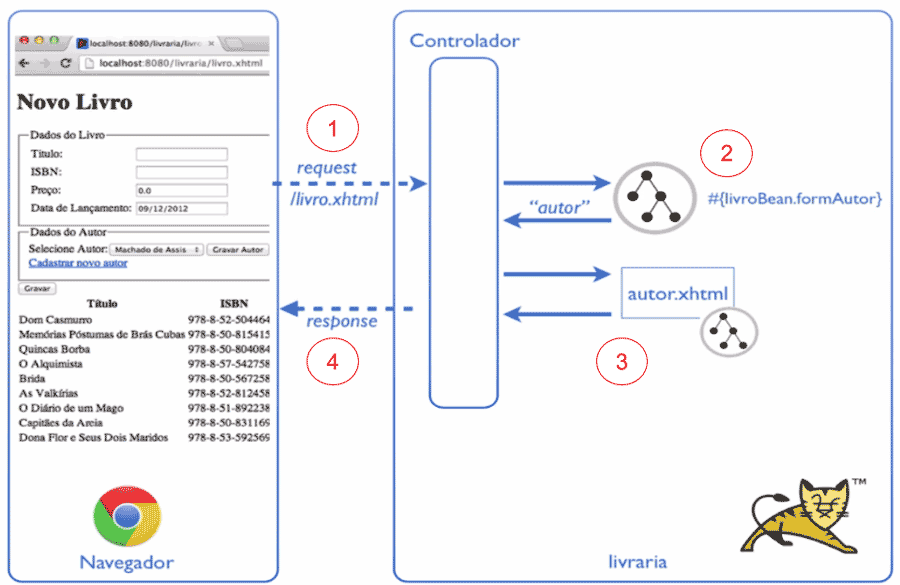
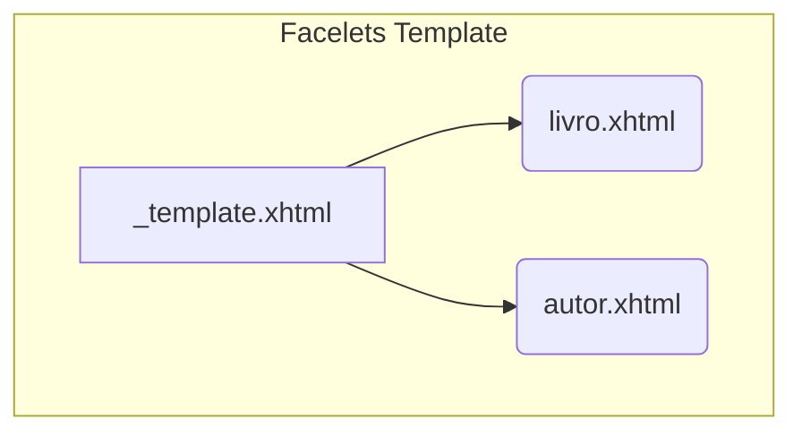

# Livraria

## Banco
- mysql-farmacia

### Docker
- Instalação e configuração do container do mysql

```
docker container run -e MYSQL_USER=andre -e MYSQL_PASSWORD=123456 -e MYSQL_DATABASE=farmacia -e MYSQL_ROOT_PASSWORD=123456 --name mysql-farmacia -p 3306:3306 mysql:5.7 --character-set-server=utf8mb4 --collation-server=utf8mb4_unicode_ci
```
- Entra no container
```
mysql -h localhost -u andre -p
```

## Aplicação


### Em aplicações Desktop
> Cliente Gordo

    - cada cliente tem uma cópia da aplicação
    - regra de negócio em cada cliente
    - atualização um a um
##
### Aplicação WEB
> Cliente magro

    - aplicação central
    - facilita a manuteção e gerenciabilidade



### Frameworks WEB
- JSF
- GWT
- APACHE WICKET
#### JSF
- é um padrão java EE para desenvolvimento web baseado em componentes mantido pelo JCP.
- Especificação JSF - JSR-245
- [JCP](https://jcp.org/en/jsr/detail?id=314)
- JSF é chamado um framework Web baseado em componentes.
- uso de componentes
- desenvolvimento orientado ao evento
- desenvolvimento stateful
- O servlet JSF tem o papel do controlador.
##### Implemantações dessa especificação
- Mojarra (Implementação referencial)
- Apache MyFaces
##### Extensões JSF
- [Prime Faces](https://www.primefaces.org/showcase/index.xhtml?jfwid=acf38)
- [RichFaces](http://showcase.richfaces.org/richfaces/component-sample.jsf?demo=select)
- [Ice Faces](http://icefaces-showcase.icesoft.org/showcase.jsf)

## Detalhes da contrução do projeto
- Pré-requisitos
    - Java SE 1.7
    - Eclipse Java EE
    - Apache Tomcat 7
- Projeto Livraria


##### Prepara tomcat
- Com o eclipse aberto
    - Digite ctrl + 3, digite server
    - clique em new server wizard
    - digite tomcat e escolha a versão 7
    - next e escolha onde salva
    - só finalizar
- Criar projeto
    - file 
    - new
    - Dynamic web project
    - coloque o nome do projeto
    - em *Target runtime* coloque Tomcat 7
    - em *Dynamic web module version* coloque 3.0
    - em *Configuration* coloque JavaServer Faces v2.0 project
    - next e na segunda marque pra gerar o web.xml
    - em *Type* coloque disable
    - em *URL Mapping pattenrs* coloque *.xhtml
- .JAR
    - todos os .jars devem fica em WEB-INF > lib

##### ATENÇÃO: Se você estiver usando MS-Windows, altere a propriedade encoding="ISO-8859-1" do cabeçalho do arquivo .xhtml para encoding="UTF-8"

##### Todo o mapeamento é feito pelo Faces Servlet
- Ao enviar a requisição é delegado o fluxo para a servlet
- O Servlet recebe a chamada e decide qual página ele vai chamar
- O controlador ler o xhtml e instância os componentes declarados
- No fim ele pega os componentes de apresentação e devolve para o navegador



### Classe Livro e LivroBean
- **Livro**: Responsabilidade de cadastrar um livro
    - atributos, getters e setters
- **LivroBean**: Responsabilidade de ser um livro
    - getter que busca o livro da classe Livro

### Model View Controller


### Ciclo de vida dos componentes JSF
- controlador instância os componentes declarados
- Árvore de componentes
    - criada apenas na primeira requisição
    - fica guardada na sessão http do usuário




- O modelo arquitetural o JSF se baseia é o MVC


### Lidando com escopos
- A vida do managedBean dura apenas um request
    - **@RequestScoped**
- Queremo que o livroBean exista emquanto a tela existir
    - **@ViewScoped**
    - Sobrevive por vários request
- O **h:selectOneMenu** é o componente próprio para a renderização de um combobox.
- Adicionamos o componente **f:selectItems** dentro do **h:selectOneMenu**, e usamos os atributos value, var, itemLabel e itemValue para respectivamente, recuperar os autores provindos do managed bean, nomear a variável que representará o autor, definir o texto que será mostrado nas opções e o valor das opções.
- Por padrão um ManagedBean adota o escopo da requisição **(@RequestScoped)**.
- Além dos escopos de requisição (@RequestScoped) e da tela (@ViewScoped) JSF também dá suporte ao escopo da sessão (@SessionScoped) e escopo da aplicação (@ApplicationScoped), tudo configurável pelas anotações.
- Utilizamos o componente h:dataTable referenciando a lista de dados pelo atributo value. Dentro do h:dataTable, utilizamos o h:column para definir as colunas que existirão na nossa tabela. No nosso exemplo, utilizamos também o h:outputText para renderizar os dados do autor dentro do h:column. Por exemplo:
```
<h:dataTable value="#{livroBean.autoresDoLivro}" var="autor">
    <h:column>
        <h:outputText value="#{autor.nome}"/>
    </h:column>
</h:dataTable>
```
### Conversão e validação de dados
- Para manipulação de datas
- Com essa anotação será gravado apenas a data
```
@Temporal(TemporalType.DATE)
private Calendar dataLancamento = Calendar.getInstance();
```
- Definindo o formato de conversão que o JSF deve utilizar
- Deve ser usado o componente f:convertDateTime para formatar a data, porém o conversor sabe lidar apenas com objetos do tipo java.util.Date. Por isso, devemos fazer um binding para #{livroBean.livro.dataLancamento.time}, onde time corresponde ao método getTime() da classe Calendar, que retorna um objeto do tipo java.util.Date.

- Devemos também definir um pattern. No nosso caso queremos dia/mês/ano então usaremos dd/MM/yyyy
```
<h:inputText id="dataLancamento"
    value="#{livroBean.livro.dataLancamento.time}">
    <f:convertDateTime pattern="dd/MM/yyyy"
        timeZone="America/Sao_Paulo" />
</h:inputText>
```
- Trabalhar com datas usando Calendar é muito mais fácil. É uma classe especializada para este dominio. Para criar uma instancia do tipo Calendar usaremos:
```
Calendar data = Calendar.getInstance()
```
Se quisermos ignorar o horário no banco de dados, podemos adicionar a anotação JPA **@Temporal**, passando como parâmetro a enum TemporalType.Date

#### Mensagens de validação
- A tag ```<h:messages />``` retorna todos os erros ocorridos na página
- Para que o erro seja exibido na mensagem, por exemplo temos que definir o campo como ```required="true"```.
- Se quisermos pesonalizar a mesagem, basta adicionar ```requiredMessage="Titulo obrigatório"``` com sua mensagem.
- Existem também os validadores como ```<f:validateLength maximum="40" />``` que define o tamanho máximo do campo, entre outros validadores.
#### **Validador personalizado**
- Valida se o valor informado começa com "1".
```
public void comecaComDigitoUm(FacesContext fc, UIComponent comp,  Object v) throws ValidatorException {
        String valor = v.toString();
        if(!valor.startsWith("1")){
            throw new ValidatorException(new FacesMessage("Deveria começar com um"));
        }
    }
```
- O atributo validator faz a associação do input com o método no **bean**
```
<h:inputText id="isbn" value="#{livroBean.livro.isbn}"
						validator="#{livroBean.comecaComDigitoUm}" />
```

### Validando preço
- O campo preço no cadastro de livros da página livro.xhtml aceita valor zerado e valores extremamente grandes. Utilize o validador f:validateDoubleRange para aceitar um valor mínimo de R$ 1,00 e máximo de R$ 1.000,00. Lembre-se que este validador possui dois atributos: minimum e maximum.

- O validador é aplicado para o componente h:inputText do preço:
```
<h:inputText id="preco" value="#{livroBean.livro.preco}" label="Preço">
  <f:validateDoubleRange minimum="1.0" maximum="1000.00"/>
</h:inputText>
```

### retornando um faces message no lugar de um throw
- Pegamos uma referência do contexto no momento da chamada
- Adicionamos uma mensagem através do addMessage, que recebe 2 parâmetros
    - client id,  ID definido no xhtml do componente
    - um objeto do tipo FacesMessage que recebe no construtor a messagem que sera mostrada.
```
FacesContext
    .getCurrentInstance()
    .addMessage("autor", new FacesMessage("Livro deve ter pelo menos um autor."));
```

### Páginas mais dinâmicas com AJAX
- Enviar apenas uma parte do formulário


- **execute** diz o ID de qual compoenete que queremos enviar na requisição
- **render** id dos componentes que queremos atualizar
- Necessário colocar o ```<h:head />``` no começo da página
```
<h:commandButton value="Gravar Autor"
    action="#{livroBean.gravarAutor}">
    <f:ajax execute="autor" render="tabelaAutores" />
</h:commandButton>
```
- o uso apropriado de requisições AJAX possibilita uma comunicação mais rápida com o servidor, dado que o mesmo só precisará responder com a parte da página que irá realmente mudar.
- Como o AJAX depende diretamente de JavaScript, é necessário que o JSF importe sua própria biblioteca JavaScript. Isso só será feito, caso o componente h:head esteja presente.

### Fases do ciclo de vida



```
<lifecycle>
    <phase-listener>
        br.com.livraria.util.LogPhaseListener
    </phase-listener>		
</lifecycle>
```


- Implementar a classe PhaseListener
- Mostra as fases em que os requests acontecem

```
public class LogPhaseListener implements PhaseListener{

    private static final long serialVersionUID = 1L;

    @Override
    public void afterPhase(PhaseEvent arg0) { }

    @Override
    public void beforePhase(PhaseEvent event) {
        System.out.println("FASE: "+event.getPhaseId());
    }
    @Override
    public PhaseId getPhaseId() {s
        return PhaseId.ANY_PHASE;
    }
}
```
- Ao receber um requisição http do tipo GET, o controlador iniciou o ciclo de vida da tela.
- leu o xhtml
- instânciou todos os componentes
- como foi a requisição inicial, fica claro que não tem nada a se fazer a não ser renderizar a resposta.



- A camada do controlador recebe todas as requisições e decide que tela ou árvore de componentes utilizar.

- **RESTORE VIEW**
    - Apenas recupera a árvore de elementos
- **APPLY REQUEST VALUES**
    - Recebe os valores digitados
- **PROCESS VALIDATIONS**
    - Conversão ou validação, se tiver erro pula as fases 4 e 5
- **UPDATE MODEL VALUES**
    - Modelo atualizado com base no request anterior, tudo de EL é atualizado
- **INVOKE APPLICATION**
    - Executa o comando Ex: gravarAutor()
- **RENDER RESPONSE**
    - Devolve a resposta

- Clicar no link para ir para outra página
- **immediate=true**
    - Fará que o link seja executado na fase *APPLY REQUEST VALUES*
- Redirecionamento no lado do servidor (forward)
- action chama um método no bean que redireciona a página para a página do autor
```
<h:commandLink value="Cadastrar novo autor"
	action="#{livroBean.formAutor}" immediate="true" />
```
- 
```
public String formAutor() {
    return "autor?faces-redirect=true";
}
```
- O padrão JSF é redirecionar para página no lado do servidor. Para chamar a página pelo navegador, ou seja enviar uma segunda requisição é preciso adicionar no retorno o parâmetro faces-redirect=true

> Redirecionamento no lado do servidor (forward)



1) O cliente dispara uma requisição (submete o formulário) para o controlador;

2) O método formAutor() é chamado pelo controlador que armazena seu retorno;

3) O controlador utilizará a String retornada pelo método para buscar a View que deverá ser renderizada. Ao encontrá-la, ele irá realizar o processo de renderização;

4) Após a renderização, o seu HTML será retornado como resposta da requisição feita pelo usuário no passo 1 (a submissão do formulário).

- Como toda requisição deve haver uma resposta, ao submetermos o formulário também precisamos de uma resposta. Só que nesse caso a resposta será o HTML de uma outra página. Por conta disso, o navegador nem sequer percebe que houve uma mudança de página e a URL na barra de endereços continua a mesma de antes da submissão.

> Redirecionamento no lado do cliente (redirect)

1) O cliente dispara uma requisição (submete o formulário) para o controlador;

2) O método formAutor() é chamado pelo controlador;

3) O Controlador do JSF retorna a resposta ao navegador com o status 302 (moved temporarily). Esse código diz ao browser que ele precisará acessar a URL contida no header location da resposta.

4) O navegador, portanto, irá acessar a página contida no header Location

5) O controlador identifica a View e realiza o processo de renderização

6) O HTML da página é retornado ao browser.

- Dessa forma o próprio navegador fica responsável por realizar o redirecionamento acessando outra página e por conta disso, a URL da barra de endereços é a da nova página que recebemos como resposta.

- Podemos citar alguma vantagem em utilizar o redirecionamento no lado do cliente ao submeter um formulário de cadastro? Pesquise sobre a técnica Always redirect after Post e responda com suas próprias palavras.

### Templates reutilizáveis com Facelets
- Por padrão, no JSF 2.0, imagens, scripts e arquivos de CSS devem estar dentro de um diretório chamado resources, que fica dentro da pasta WebContent.



- **graphicImage** para adicionar imagens
- **library** nome da pasta que ficará armazenadas as imagens
- **ui:insert** :Esta tag indicará para as páginas que utilizarem o template que há uma área com name titulo que pode ser preenchida.

```
<?xml version="1.0" encoding="ISO-8859-1" ?>
<!DOCTYPE html PUBLIC "-//W3C//DTD XHTML 1.0 Transitional//EN" "http://www.w3.org/TR/xhtml1/DTD/xhtml1-transitional.dtd">
<html xmlns="http://www.w3.org/1999/xhtml"
	xmlns:h="http://xmlns.jcp.org/jsf/html"
	xmlns:f="http://xmlns.jcp.org/jsf/core"
	xmlns:ui="http://xmlns.jcp.org/jsf/facelets">
	
	<h:head />
	
	<h:body>
		<div id="cabecalho">
			<h:graphicImage library="img" name="logo.png" width="200" height="100" />
			
			<h:form rendered="#{usuarioLogado != null}">
				<h:commandLink value="logout" action="#{loginBean.deslogar}" />
			</h:form>
			<h1>
				<ui:insert name="titulo"></ui:insert>
			</h1>
		</div>
		
		<div id="conteudo">
			<ui:insert name="conteudo"></ui:insert>
		</div>
	</h:body>
</html>
```
> Associação da página com o template
- O namespace utilizado para importar a biblioteca de facelets é xmlns:ui="http://java.sun.com/jsf/facelets".
- A associação é feita envolvendo todo o conteúdo da página que importará o template pela tag ui:composition, indicando pelo atributo template, o template a ser associado.

```
<html xmlns="http://www.w3.org/1999/xhtml"
    xmlns:h="http://java.sun.com/jsf/html"
    xmlns:f="http://java.sun.com/jsf/core"
    xmlns:ui="http://java.sun.com/jsf/facelets">

<ui:composition template="_template.xhtml">
    <ui:define name="titulo">
            Novo Livro
    </ui:define>
    <ui:define name="conteudo">
                <!--codigo omitido -->
    </ui:define>
</ui:composition>
</html>         
```

#### Implementando a exclusão
```
<h:column>
    <f:facet name="header">Remover</f:facet>
    <h:commandLink value="Remover" action="#{livroBean.remover(livro)}" />
</h:column>
```

#### Ajustando o relacionamento
- O problema está no relacionamento dos livros com os seus autores. Um livro pode ter muitos autores, e um autor pode escrever vários livros, por isso a relação deles é de many-to-many (muitos para muitos). No Hibernate, qualquer relação *ToMany é LAZY, isso porque essas relações *toMany são provavelmente mais custosas, trazendo mais objetos para a memória. Ok, mas o que isso interfere no nosso projeto?

- Isso significa que quando carregamos os livros, os autores não são carregados ao mesmo tempo. Ou seja, quando clicamos em "Alterar", conseguimos carregar os dados do livro, mas não os do autor! Por isso ocorre a exceção.

- Para resolver isso, podemos dizer para o Hibernate para, quando carregar um livro, automaticamente carregar os seus autores, ou seja, ao invés de LAZY, queremos que a relação seja EAGER. Então lá na classe Livro, adicionamos essa opção na anotação:

- O erro LazyInitializationException pode acontecer quando tentarmos acessar um relacionamento não inicializado. Uma das primeiras formas (existem outras, inclusive mais elegantes) é alterar o tipo de relacionamento seja @ManyToMany ou OneToMany. Essa alteração diz respeito ao tipo de busca que é realizada. O padrão é preguiçoso, contudo, se quisermos alterá-lo para um carregamento do tipo ansioso fazemos:
```
@ManyToMany(fetch=FetchType.EAGER)
private List<Autor> autores = new ArrayList<Autor>();
```

- Repare que esse método faz muito pouca coisa, é apenas um atribuição do parâmetro livro para o atributo this.livro (parecido com um setter). Há um atalho para tal atribuição que JSF oferece. Podemos usar o componente f:setPropertyActionListener com o mesmo efeito:
```
<h:commandLink value="Alterar" >
    <f:setPropertyActionListener target="#{livroBean.livro}" value="#{livro}" />
</h:commandLink>COPIAR CÓDIGO
```
- Repare que o h:commandLink não possui o atributo action. A ação é definida pelo componente f:setPropertyActionListener.
- O comando f:setPropertyActionListener deve ficar dentro da tag h:commandLink
- Assim não precisamos do método carregar, mas é preciso implementar o setter para o atributo livro pois o atributo target exige o setLivro no LivroBean.

### Anotações
- Indica que a classe será gerenciada pelo JSF
    - **@ManagedBean**
## Acesso aplicação
- Principal 
- http://localhost:8080/jsf-livraria/livro.xhtml
- http://localhost:8080/jsf-livraria/autor.xhtml