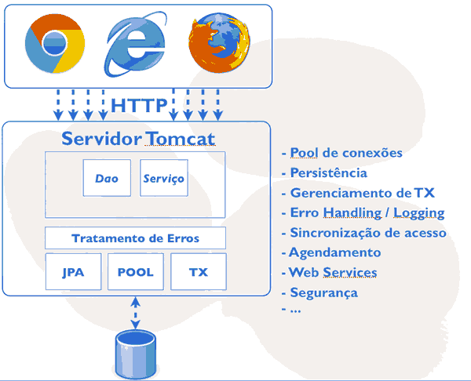
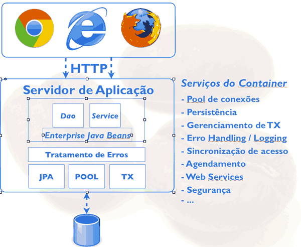
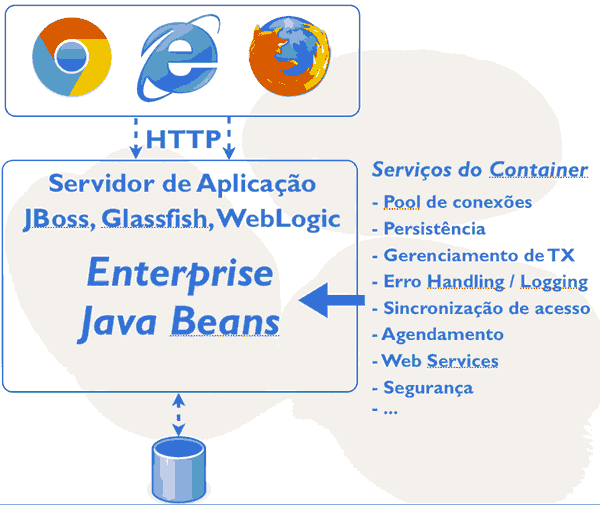
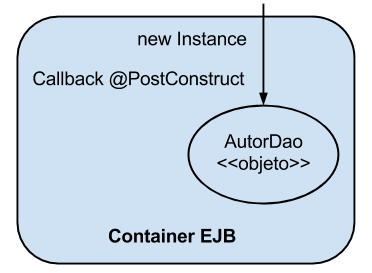
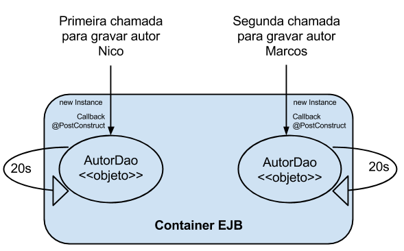
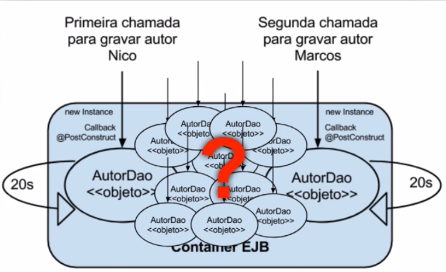
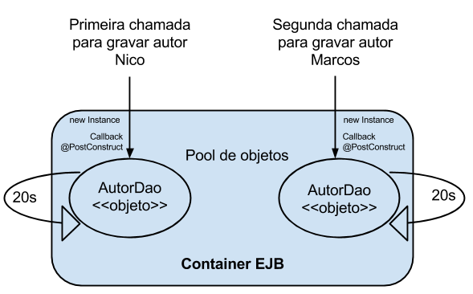

### Links Uteis
- [JBOSS 7](http://127.0.0.1:9990/error/index_win.html)
- [Livraria Login](http://localhost:8080/livraria/login.xhtml)
- login: admin
- senha: pass

###
- Começaremos a desenvolver uma aplicação Java com EJB. Já temos um ambiente de desenvolvimento pré-configurado baseado no Java SE 7 e utilizaremos como IDE o Eclipse IDE for Java EE Developers.
- O servidor de aplicação JBoss AS 7 da Red Hat.
- [JBoss AS 7](https://jbossas.jboss.org/downloads)

### Introdução ao EJB
- Hoje em dia, a grande maioria das aplicações são desenvolvidas para executar na web. Ou seja, usamos um navegador para acessar o servidor através do protocolo HTTP. Para fazer isso funcionar basta termos um servidor como o Apache Tomcat, bastante utilizado em outros treinamentos no Alura. Com ele podemos executar uma aplicação feita com JavaServer Faces (JSF) ou outros frameworks MVC (Model-View-Controller).

- A maioria das aplicações utilizam um banco de dados como o MySQL ou Oracle, entre várias outras opções do mercado. Nesse caso, a nossa aplicação deve se preocupar em gerenciar as conexões com o banco, o que normalmente é feito através de um pools de conexões. A escolha e configuração correta do Pool é de grande importância para qualquer aplicação e afeta diretamente o desempenho e escalabilidade.

- Para persistirmos e acessarmos dados usando o paradigma orientado a objetos podemos usar frameworks de Mapeamento-Objetos-Relacional (MOR) como o Hibernate ou EclipseLink, que seguem a especificação JPA (Java Persistence API). A integração do framework deve ser feita da melhor maneira possível para evitar desperdício de recursos e mau uso do banco de dados.

- Alteração de dados no banco mesmo com JPA envolve transações que precisam ser gerenciadas, tarefa difícil de se fazer de maneira robusta. O mau gerenciamento das transações é um problema comum nas aplicações e pode causar problemas nas consistência dos dados.

- Ao trabalhar com todos esses recursos, erros ou exceções podem aparecer. Ou seja, sempre devemos ter uma estratégia para lidar com as possíveis exceções que a aplicação pode causar.

- As classes da aplicação, como os Data Access Objects (DAOs) e as classes de serviços, serão utilizadas quando ocorrer uma requisição HTTP. A pergunta é: como podemos garantir que não há problemas de acesso e sincronização quando a quantidade de requisições crescer? Não é raro ver aplicações que começam a gerar problemas quando a demanda cresce.

- Outra tarefa comum é executar tarefas periodicamente. Há aplicações que precisam agendar a execução de processos. Por exemplo, pode ser necessário enviar um email cada dia, ou verificar uma tabela no banco de dados a cada hora. O agendamento correto, no tempo exato é essencial para várias aplicações, e não é algo fácil de se implementar.

- Durante o desenvolvimento de uma aplicação surgem várias outras preocupações, tais como o uso de Web Services ou mesmo a segurança da aplicação, ambos importantíssimos. Em geral, todas essas preocupações listadas são agnósticas às regras de negócio. É algo que faz parte do desenvolvimento, mas não deveriam ser a preocupação principal.



- A tarefa de um servidor de aplicações é justamente livrar o desenvolvedor dessas preocupações e fornecer uma infra-estrutura pronta para que ele possa utilizar. Ou seja, não é a aplicação que vai gerenciar a transação ou se preocupar com o agendamento de tarefas. Vamos inverter o controle e deixar o servidor de aplicações fazer essa parte.

- Por isso, essas preocupações também se chamam serviços do container ou serviços do servidor. Transação, persistência, etc. são serviços que o servidor de aplicações fornece.



- Por exemplo, a classe DAO da minha aplicação deve ter acesso ao JPA sem se preocupar em como inicializa-lo. Para isso funcionar o Enterprise Java Beans (EJB) fornece o componente ( Entity Bean ), que é responsável pelo controle de transações de persistência de dados. O próprio DAO vai ser um EJB e assim poderá utilizar a JPA sem problemas.

- Em outras palavras, é através dos EJBs que temos acesso aos serviços que o servidor oferece sem nos preocuparmos em como cada um deles foi inicializado. Então, para usar os EJBs, sempre precisamos de um servidor de aplicações.

- Falta saber qual servidor de aplicação usaremos no treinamento. O Apache Tomcat não serve, pois não é um servidor de aplicações completo. Contudo há outras opções como RedHat JBoss AS, Oracle Glassfish, Apache Geronimo ou Oracle WebLogic, entre outros. Usaremos o JBoss AS, o servidor Java EE mais popular, opensource e totalmente gratuito.



> Preparação do ambiente de desenvolvimento
1) Vamos então baixar o JBoss Application Server para começar a usar os EJBs. Para tal, acesse o site http://jbossas.jboss.org/;
2) Na página principal escolha a opção Downloads, depois selecione a versão JBoss AS 7.1.1.Final no formato ZIP.
3) Além disso, vamos utilizar o Eclipse como IDE de desenvolvimento disponível em: www.eclipse.org/downloads/

- Importante é baixar a versão Eclipse IDE for Java EE Developers que já vem com vários plugins para o desenvolvimento web. É preciso selecionar o Eclipse para o seu sistema operacional, já que o Eclipse depende dele.
- No nosso caso já temos JBoss AS e Eclipse baixados, só falta extrair os arquivos.
4) Enquanto estão sendo extraídos os arquivos, vamos aproveitar o tempo e verificar a versão da Java Virtual Machine (JVM) instalada em nosso computador. Abrimos um terminal e ao executar o comando java -version aparece corretamente a verão 1.7 da JVM da Oracle.

### Instalação do Server Adapter
- Hora de iniciar o Eclipse... Ao abrir, o Eclipse pergunta qual pasta ou workspace queremos usar para os nossos projetos, mas também nos sugere uma pasta padrão. É essa que vamos utilizar. Portanto só é preciso confirmar.

- Vamos fechar a tela inicial do Eclipse. O próximo passo é configurar o JBoss AS como servidor dentro do Eclipse. Para isso existe a aba Servers, onde configuraremos o JBoss. Já baixamos e extraímos o JBoss antes, então vamos criar um novo Server dentro do Eclipse.

- Aqui nós temos um problema. É que na lista padrão de servidores disponíveis não aparece a versão do JBoss AS que baixamos. Só existe JBoss até a versão 5.

- Para podermos configurar o JBoss 7 é preciso baixar um novo server adapter pelo link acima. O Eclipse atualiza a tela com os server adapters disponíveis e logo veremos o JBoss AS Tools. É isso que estamos procurando.

- Basta selecionar e confirmar na próxima tela para concluir a instalação. A instalação pode demorar um pouco, pois vai baixar vários arquivos. Ao final dela, vamos reiniciar o Eclipse para aplicar as alterações.

- Agora, vamos repetir o processo novamente, selecionar na aba Servers o link para criar um novo servidor. Agora aparece na lista de servidores disponíveis o JBoss AS 7.1.
- A configuração é simples, basta encontrar e selecionar a pasta do servidor JBoss, ou seja, aquela pasta que extraímos antes.
- No nosso caso, também vou escolher a versão 1.7 da JVM que roda o JBoss. Pronto, só falta finalizar. Na aba Servers aparece o JBoss com alguns arquivos de configuração. Para iniciar clique no botão verde no lado esquerdo do Eclipse.
- Ao inicializar aparece na view console do Eclipse a saída do JBoss. Dando uma olhada no console, vemos que bem no final nos foi informado a interface web do JBoss.
- Vamos testar no navegador digitando localhost:9990.
- A tela do JBoss AS indica que conseguimos iniciar o servidor!

### Primeira aplicação com EJB
- Vamos começar a usar os EJBs, mas para não começar do zero, preparamos um projeto que está disponível nos downloads. Vamos importar esse projeto no Eclipse.

- No menu File -> Import escolhemos General -> Existing Project Into Workspace e depois Archive file para selecionar o arquivo livraria.zip.

- Esse projeto nada mais é do que um Dynamic Web Project. Nele já foram criadas algumas classes e a interface web, mas não há nada especifico do EJB ainda. Criamos este projeto apenas por fins didáticos.

- Ao importá-lo, verifique se todas as classes estão compilando. Veja que no projeto existe um problema, pois as biblioteca do JBoss ainda não fazem parte do projeto web.

- Vamos configurar isso: botão direito no projeto livraria, depois escolha Java Build Path. Na aba Libraries aperte o botão Add Library, escolha Server Runtime e o JBoss 7. Através dessa configuração as bibliotecas no JBoss fazem parte do classpath.

- Falta ainda associar o projeto com JBoss. Na aba Servers, botão direito Add and Remove..., e escolha o projeto livraria. Ao confirmar o JBoss carrega a aplicação. Podemos ver no console a saída: Deployed "livraria.war" .

### Apresentação do projeto
- A aplicação livraria usa JSF e Primefaces para definir a interface. Há um outro treinamento no Alura que ensina essas duas tecnologias caso esteja com dúvidas ou queira aprender mais.
- Vamos testar a aplicação acessando no navegador:

```
http://localhost:8080/livraria/login.xhtml
```
- Há uma página de login: o login é admin a senha é pass . Após efetuado o login somos redirecionados para a página principal de aplicação. Trata-se de um cadastro de livros e autores, com abas para cada funcionalidade além do logout.
- Uma coisa que podemos observar na página é que os acentos estão errados. Pode haver vários motivos por este problema, mas no nosso caso basta redefinir a codificação do projeto. No Eclipse, nas propriedades do projeto, basta selecionar UTF-8 no item Resource.
- Vamos reiniciar o servidor JBoss e recarregar a aplicação para publicar a mudança. Após login, podemos ver que os acentos estão certos.
- Falta testar uma vez a interface. Vamos cadastrar um autor apenas digitando seu nome... pronto. E depois verificar a existência do autor no combobox do cadastro de livros. Apareceu ... vamos cadastrar também um novo livro. Foi inserido com sucesso.

- É importante mencionar que todos os dados ficam em memória, não há persistência por enquanto. Ou seja, ao reiniciar o servidor perderemos os dados inseridos anteriormente. Veremos como integrar o JPA com EJB mais para frente.

- Vamos dar uma olhada no código fonte. Há 4 pacotes no projeto. O modelo possui as classes do domínio como Livro, Autor e Usuario. Para cada modelo existe um DAO para persistir os dados, mas como não usamos um banco de dados ainda, simulamos através da classe Banco um banco de dados em memória. Nessa classe também se encontram os livros e autores já cadastrados. Cada DAO, por sua vez, usa a classe Banco.

### O primeiro Session Bean
- Como falamos, ao usar EJB, teremos acesso aos serviços do servidor de aplicação, como transação, persistência com JPA ou tratamento de erro. Para transformar a classe AutorDao em um EJB basta uma configuração simples. Só precisamos anotá-la com @Stateless:

```
@Stateless
public class AutorDao{
```
- Vamos republicar a aplicação e analisar o console para realmente ver que a anotação causou uma mudança. Selecione a aplicação na aba Servers, usando Full publish.

- Repare na saída algumas informações sobre a classe AutorDao. Ao subir, o servidor - para ser mais correto, o EJB Container - achou aquela anotação @Stateless e registrou esse EJB dentro de um registro disponível no servidor. Aquele registro se chama JNDI e o que estamos vendo na saída é o endereço do EJB nesse registro JNDI. O servidor usa por baixo dos panos esse registro JNDI para organizar os componentes que ele administra.

- Voltando ao Eclipse, vamos também configurar os outros DAOs como EJB. Abra a classe LivroDao e use novamente a anotação @Stateless. Faça o mesmo para a classe UsuarioDao.
```
@Stateless
public class LivroDao{

@Stateless
public class UsuarioDao{
```
- Ao subir o servidor devem aparecer no console os endereços desses EJBs também.

### Injeção de dependências
- Na nossa aplicação, os DAOs são utilizados através das classes que ficam dentro do pacote bean. Abra a classe AutorBean. Essa classe é utilizada através da interface JSF, ela é chamada pelos componentes JSF definidos no arquivo autor.xhtml.
- Para saber mais sobre o JSF também assista ao treinamento disponível no Alura.
- Na classe AutorBean, podemos ver que estamos usando a classe AutorDao para gravar e listar autores. Repare também que estamos instanciando a classe AutorDao:

```
public class AutorBean {

  private AutorDao dao = new AutorDao();//criação do DAO

  //outros métodos e atributos omitidos
}
```

- É justamente essa a linha que precisa ser alterada. Ao usar EJB, não podemos mais instanciar o AutorDao na mão. Estamos assumindo o controle ao criar o DAO naquela linha. Nesse caso não estamos usando o AutorDao como um EJB.

- O DAO está sendo administrado pelo EJB Container. Portanto, quem cria o DAO é o EJB Container e não a minha classe. Consequentemente precisamos pedir ao EJB Container passar aquela instancia que ele está administrando. Felizmente, isso é fácil de fazer, basta usar a anotação @Inject:

```
public class AutorBean {

  @Inject
  private AutorDao dao; //sem new

  //outros métodos e atributos omitidos
}
```

- Pronto, o EJB será injetado! Essa parte da inversão de controle também é chamado Injeção de dependências. O DAO é uma dependência que será injetada pelo container.
- Faremos a mesma coisa na classe LivroBean. Mas além do AutorDao ela usa também o LivroDao. Vamos tirar o "new" e usar a anotação @Inject em cada atributo:

```
public class LivroBean {

  @Inject
  private AutorDao autorDao; //sem new

  @Inject
  private LivroDao livroDao; //sem new

//outros métodos e atributos omitidos
}
```

- Está tudo pronto para testar. Vamos publicar as alterações e acessar a aplicação pela interface gráfica. Nada mudou ao carregar a página e efetuar o login, ou seja, a aplicação continua funcionando. Já estamos usando EJB! Ainda é pouco vantajoso o uso do EJB, mas, como já falamos, temos agora acesso aos vários serviços do servidor. Veremos nos próximos capítulos como aproveitar a infra-estrutura pronta do servidor usando EJBs.

> Adotando um Servidor de Aplicações que implemente as especificações da arquitetura Java Enterprise Edition (JEE). A tarefa de um servidor de aplicações é justamente livrar o desenvolvedor dessas preocupações e fornecer uma infra-estrutura pronta para que o desenvolvedor possa aproveitar. Ou seja, não é a aplicação que vai gerenciar a transação, a conexão com o banco de dados ou se preocupar com o agendamento de tarefas. Vamos inverter o controle e deixar o servidor de aplicação fazer toda essa parte.

> O servidor Apache Tomcat não pode ser considerado um servidor de aplicações completo porque não implementa toda a especificação Java Enterprise Edition (Java EE).

> Utilizando a arquitetura EJB, as regras de negócio são implementadas em componentes específicos que são chamados de Session Beans. O EJB Container administra esses componentes oferecendo diversos recursos a eles.

> Do Stateless Session Bean é o primeiro tipo de Session Bean. Os Stateless Session Bean não mantém estado de conversação com o cliente, não têm compromisso de manter uma sessão, são intercambiáveis e podem ser alocados de um pool e são EJBs econômicos;
- Não mantém estado de conversação com o cliente;
- Não tem compromisso de manter uma sessão;
- São intercambiáveis e podem ser alocados de um pool;
- É um EJB econômico;
> Na versão 3.1, quando o acesso a um EJB Stateless Session Bean é local, não é mais necessário definir uma interface java nem utilizar a anotação @Local. Então, bastaria criar uma classe java com a anotação @Stateless.
> Ao usar EJB, não podemos mais instanciar o AutorDaoe o LivroDao na mão. Estamos assumindo o controle ao criar o DAO naquelas linhas (1) e (2). Nesse caso não estamos usando o AutorDao e o LivroDao como EJBs.
- O DAO está sendo administrado pelo EJB Container. Portanto, quem cria o DAO é o EJB Container e não a minha classe. Consequentemente precisamos pedir ao EJB Container para passar aquela instância que ele está administrando. Felizmente, isso é fácil de fazer, basta usar a anotação @Inject:

## Capítulo 2
- No último capítulo, vimos como preparar o ambiente e começar a usar os EJBs. Vimos o primeiro tipo de EJB, o Session Bean Stateless. Para configurar uma classe como Session Bean usamos a anotação @Stateless acima da classe. Essa configuração mínima já faz com que o EJB Container tome conta (ou controle) esse objeto.
- Nas classes Bean usamos a anotação @Inject para receber o EJB pronto para ser utilizado. Chamamos de Injeção de dependência essa forma de receber uma instância.
Ao iniciar o servidor podemos ver no console os endereços dos 3 EJB Session Beans que já configuramos.
- Nesse capítulo vamos aprender mais sobre Ciclo da vida dos Session Bean. Vamos entender como o EJB Container controla os objetos e como interferir nesse controle quando necessário.

### Callbacks
- Vamos voltar à classe AutorDao e adicionar um método que chamaremos aposCriacao. Nele faremos um simples syso para imprimir uma mensagem:
```
void aposCriacao() {
    System.out.println("AutorDao foi criado");
}
```
- Este método não precisa ser público, pois ele não será chamado pela classe AutorBean. Basta anotá-lo com @PostConstruct e ele será chamado pelo próprio EJB Container:
```
@PostConstruct
void aposCriacao() {
    System.out.println("AutorDao foi criado");
}
```
- Assim que o Container cria e inicializa o Session Bean, o método aposCriacao é executado. Esse tipo de método ligado ao ciclo de vida do Session Bean também é chamado de Callback.


- Vamos testar a funcionalidade e publicar a aplicação. Assim que o servidor recarregá-la, - vamos limpar o console e chamá-la pela interface.

- Ao acessar a URI pelo navegador e passar pela tela de login, podemos ver que o combobox com os autores está populado, ou seja, o EJB Container já criou o AutorBean. Isso fica claro no console do Eclipse. Repare que aparece a saída AutorDao foi criado. O EJB Container instanciou o Session Bean e chamou o método callback.

### Thread safety
Vamos testar mais um pouco a aplicação e acessar pela interface web a página dos autores, navegando entre as abas. Muito bem. Voltando ao Eclipse, podemos ver no console que continua apenas uma saída do nosso método callback. Isso significa que apenas um Session Bean foi criado, já que o container sempre chama o callback na criação.

Vamos testar isso melhor e simular um pouco a execução lenta do método salva no AutorDao.

Primeiro colocaremos um Syso no inicio do método e um Syso no final do método para saber quando a execução começou e quando terminou.

Segundo, vamos travar a execução da thread atual usando o comando Thread.sleep(..). No nosso exemplo, o thread atual vai dormir por 20 segundos. O método sleep(..) exige um tratamento de erro, por isso é preciso fazer um try-catch e podemos gerá-lo pelo Eclipse. Pronto.

Depois da alteração, faremos o publish obrigatório para recarregar a aplicação. Depois de ter limpado o console, vamos acessar a aplicação web pelo navegador. Logo após login, vamos para a página de autores para cadastrar um autor.

Ao salvar, podemos perceber que o nome do autor não aparece imediatamente na lista de autores abaixo. Isso acontece, pois a thread para salvar o autor ainda está em execução. Travamos por 20 segundos. Repare no console que o AutorDao foi criado e o método salva(), que está sendo executado, não terminou ainda.

Vamos rapidamente abrir uma nova aba e recarregar a aplicação para cadastrar mais um autor. Ao salvar novamente a thread parou, mas podemos observar no console que mais um AutorDao foi criado, pois apareceu a saída do callback. Ou seja, como o primeiro objeto Session Bean estava em uso, o EJB Container decidiu criar mais um para atender a chamada. Só depois, quando os 20s passaram, aparece a última mensagem no console e consequentemente o autor é listado na interface.

Esse pequeno exemplo mostrou que um Session Bean não é compartilhado entre Threads. Apenas uma thread pode usar o nosso AutorDao ao mesmo tempo. Um Session Bean é automaticamente Thread safe. Thread safety é um dos serviços que ganhamos de graça ao usarmos EJBs.



### Pool de Objetos
Vimos que o EJB Container criou um segundo objeto do tipo AutorDao, pois o primeiro estava sendo usado. EJB Container fez isso para melhorar o desempenho, já que o Sesson Bean não é compartilhado.

A pergunta é, quantos objetos o EJB Container serão criados? Se eu tiver 100 threads ao mesmo tempo, 100 objetos AutorDao serão criados em memória?



O EJB Container automaticamente fornece um pool de objetos que gerencia a quantidade do Session Beans. A configuração desse pool se encontra no arquivo de configuração do JBoss AS, ou seja, é totalmente específico.



Vamos abrir o arquivo `standalone.xml` da pasta de `standalone/configuration`. Nele procuraremos o elemento `<pools>`. Dentro desse elemento, encontraremos a configuração do pool para session beans. Repare o atributo max-pool-size que define a quantidade de objetos no pool. No nosso caso são 20 instancias.
```
<pools>
    <bean-instance-pools>
        <strict-max-pool name="slsb-strict-max-pool" max-pool-size="20" instance-acquisition-timeout="5" instance-acquisition-timeout-unit="MINUTES"/>
        <!-- outros elementos omitidos -->
    </bean-instance-pools>
</pools>
```
Vamos fazer um teste e configurar o pool com apenas 1 instancia. Basta colocar o valor no atributo max-pool-size. Como alteramos o arquivo principal de configuração é necessário reiniciar o servidor. No final limparemos o console para acompanhar melhor o trabalho do EJB Container.

```
<pools>
    <bean-instance-pools>
        <strict-max-pool name="slsb-strict-max-pool" max-pool-size="1" instance-acquisition-timeout="5" instance-acquisition-timeout-unit="MINUTES"/>
        <!-- outros elementos omitidos -->
    </bean-instance-pools>
</pools>
```
Vamos fazer o mesmo teste, ou seja, acessar a nossa aplicação através de duas abas, simulando duas ações de usuário executado ao mesmo tempo. Após ter feito o login, vamos para a aba autores. Não podemos esquecer de atualizar a outra aba também. Quando estiver pronto podemos salvar o primeiro autor.

No console, aparecem as mensagens do callback e do método salva(...). Até aqui tudo igual. Vamos para a segunda aba para salvar um outro autor. Ao salvar e analisar o console NÃO aparece a mensagem do callback. Isso faz sentido, pois configuramos para que exista apenas um objeto AutorDao. Enquanto a primeira ação não finalizar, não é possível acessar esse objeto, pois, como já mencionamos, os Session Beans são thread safe. Repare que o console mostra que na execução foi um depois do outro, já que existe apenas um objeto do tipo AutorDao em memória.

Repare que a configuração do tamanho do pool influencia diretamente na escalabilidade da aplicação. Ter apenas um objeto AutorDao em memória significa que só podemos atender um chamado por vez. Por isso faz sentido, para objeto DAO, aumentar a quantidade de objetos no pool.

Por fim, vamos desfazer a alteração no arquivo standalone.xml e configurar novamente 20 instancias no pool. Como mexemos no xml, não podemos esquecer de reiniciar o servidor. No método salva(..) também vamos comentar o código que mandou o Thread atual dormir. Pronto.

### Singleton Beans
Já aprendemos como configurar as classes DAOs, agora vamos atacar a classe Banco. O Banco ainda não é um EJB Session Bean. Podemos facilmente mudar isso e colocar a anotação @Stateless em cima da classe como vimos nos exemplos anteriores

```
@Stateless
public class Banco {
```
E, por exemplo, no AutorDao, vamos injetar o banco. Para tal, não devemos instanciar o Banco e sim, usar a anotação @Inject:

```
@Inject
private Banco banco;
```
Voltando para classe Banco, vimos, no exemplo anterior, que existe um pool de objetos para Session Beans. Ou seja, como o Banco é um Session Bean, teremos, no máximo, 20 instancias em memória.

Nesse caso pode surgir a pergunta, faz sentido ter todas essas instancias dessa classe? Claro que não! Apesar do fato de que essa classe só existe para simular um banco de dados, não faz sentido nenhum ter mais do que um objeto dessa classe. É preciso ter apenas um único objeto para simular o banco.

Felizmente podemos configurar isso sem mexer na configuração XML do JBoss AS. Basta usar a anotação `@Singleton`:

```
@Singleton  // do package javax.ejb
public class Banco {
```
Para ter certeza que não existem mais instâncias, vamos fazer o mesmo teste. Na classe Banco adicionaremos um método de callback usando a anotação @PostConstruct:

```
@PostConstruct
void aposCriacao() {
    System.out.println("acabou de criar o Banco");
}
```

Se tudo estiver configurado, podemos iniciar o JBoss AS para testar a aplicação com o novo Singleton Session Bean. Na saída do console, podemos ver que o EJB Container já entrou e carregou o Banco. Repare que existe uma saída parecida com a dos outros Session Beans.

Só falta limpar o console e acessar a interface web. Após o login, o conteúdo de ambos os callbacks é impresso no console; aquele do AutorDao e esse novo do Banco.

Vamos cadastrar uma vez um Autor pela interface para verificar se realmente existe uma única instancia do Banco. Como esperado, o console indica que o callback foi só uma vez.

### Eager Initialization
Session Beans do tipo Singleton são tipicamente usados para inicializar alguma configuração ou agendar algum serviço. Fazer isso só faz sentido no inicio da aplicação, ou seja, quando o JBoss AS carrega a aplicação e já queremos que o Session Bean seja criado para carregar todas as configurações.

Por padrão um EJB é carregado sob demanda (lazy), mas através da anotação @Startup podemos definir que queremos usar o Singleton Bean desde o início da aplicação:

```
@Singleton //do package javax.ejb
@Startup
public class Banco {
```

Para testar, vamos recarregar a aplicação, ou seja, Full Publish aba Servers do Eclipse. Após ter carregado a aplicação, aparece no console a saída do callback. O Banco já é criado e inicializado pelo EJB Container.

Aquela inicialização com `@Startup` também é chamada **eager initialization** e a testaremos nos exercícios.

> EJB Container cria e inicializa o Session Bean, o método anotado com @PostConstruct é executado. Esse tipo de comportamento está ligado ao ciclo de vida do Session Bean e também é chamado de Callbacks.

> **Thread Safety** Significa que um EJB Session Bean não é compartilhado entre Threads. Ou seja, quando um Session Bean estiver em uso, o EJB Container decide criar mais um Session Bean para atender uma nova chamada. Uma estratégia usada pelos servidores de aplicação para isso é o Pooling for Stateless Session EJBs.

> O atributo é max-pool-size, que por default está configurado para 20 objetos Stateless Session Bean (SLSB) no pool.

> Qual a principal característica do Singleton Session Bean? Ele garante que haverá somente uma instância do Session Bean.

> Por padrão um EJB é carregado sob demanda (`lazy`), mas através da anotação @Startup podemos definir que queremos usar o Singleton Bean desde o início da aplicação. Inicialização com `@Startup` também é chamada eager initialization.

### Session Bean Stateful (SBSF)
Há mais um tipo de EJB Session Bean. Além dos Session Beans Stateless e Singleton, existe um Session Bean do tipo Stateful. Basta anotar a classe com @Stateful, por exemplo:
```
@Stateful
public class CarrinhoDeCompras {
 //...
}
```
Um Session Bean Stateful (SBSF) também é um objeto administrado pelo EJB Container. Assim ele ganha os serviços oferecidos pelo Container como injeção de dependências, transação ou JPA (como veremos mais para frente).

Qual é a diferença entre `Stateful` e `Stateless` então?

Vimos que Session Beans `Stateless` são objetos que fazem parte de um pool. Esse pool não existe para Session Bean `Stateful`. Um SBSF funciona parecido com o objeto HttpSession do mundo de Servlets. É um objeto exclusivo de um cliente, apenas um cliente usará este objeto.

Podemos imaginar que um Session Bean `Stateful` funciona como um carrinho de compras. Cada cliente possui o seu carrinho e ele utilizará o mesmo carrinho o tempo todo. Não queremos compartilhar esse carrinho com ninguém (as compras são nossas). Um Session Bean `Stateful` garante esse comportamento.

No entanto, no dia a dia os SBSF são pouco usados. Isto porque normalmente se usa o objeto HttpSession para guardar dados do cliente (como o carrinho de compras ou as permissões do usuário). Como já usamos esse objeto dentro do servlet container não é preciso repetir essas informações através do EJB Container. Assim muitos arquitetos preferem usar apenas Stateless/Singleton em conjunto com o HttpSession.

> O Session Bean Stateful (SBSF) tem uma funcionalidade muito parecida com a do objeto HttpSession: representa um objeto para o cliente. Ideal para guardar informações que só dizem respeito ao cliente. Exemplos disso são carrinhos de compras ou permissões.

> A diferença entre Session Bean Stateful e HttpSession é que o primeiro é administrado pelo EJB Container e o segundo pelo Servlet Container.